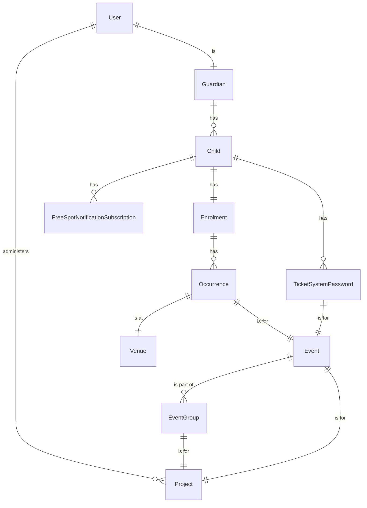

# How to integrate the Culture Kids to Helsinki-Profile GDPR API

As background information and instructions for integrating the service with Helsinki-Profile, see the documentation for [How to integrate to Helsinki-Profile through Tunnistamo](./docs/how-to-integrate-to-Helsinki-profile-with-Tunnistamo.md).

> NOTE: The user profiles authenticates themselves in a centralized authentication server of the city of Helsinki. For long it has been [Tunnistamo](https://github.com/City-of-Helsinki/tunnistamo), but in the summer of the year 2024, it should be changed to a Keycloak service of the [Helsinki-Profile](https://github.com/City-of-Helsinki/open-city-profile) service environment.

The Tunnistamo can be configured to be used [locally](../docs/setup-tunnistamo.md#use-a-local-tunnistamo) or from the [test environment](../docs/setup-tunnistamo.md#use-the-public-test-tunnistamo).

The Keycloak test environment can also be configured to be used [locally](./docs/setup-keycloak.md).

# GDPR API data export

Django model hierarchy used in GDPR API data export (This graph is based on the Django models' `serialize_fields` values):



# Kukkuu GDPR API tester

- The GDPR API Tester source code is available https://github.com/City-of-Helsinki/profile-gdpr-api-tester.
- The GDPR API source code is available in https://github.com/City-of-Helsinki/helsinki-profile-gdpr-api.

Use the following configuration in local usage when running the GDPR API Tester in a Docker container:

```shell
> config
Configuration:
  ISSUER = http://localhost:8888/
  ISSUER_TYPE = tunnistamo
  GDPR_API_AUDIENCE = https://api.hel.fi/auth/kukkuu
  GDPR_API_AUTHORIZATION_FIELD = https://api.hel.fi/auth
  GDPR_API_QUERY_SCOPE = kukkuu.gdprquery
  GDPR_API_DELETE_SCOPE = kukkuu.gdprdelete
  GDPR_API_URL = http://host.docker.internal:8081/gdpr-api/v1/user/$user_uuid
  PROFILE_ID = 9bffd8a2-d35a-11eb-a43a-0242ac130006
  USER_UUID = cfe6ca14-f651-11ee-9c57-acde48001122
  LOA = substantial
  SID = 00000000-0000-4000-9000-000000000001
```

To run the GDPR API Tester in a Docker container:

```shell
docker run -i -p 8888:8888 --env-file .env gdpr-api-tester
```

Then, to create some data in the database, we can use the Django Python shell and Factoryboy model instance factories.

Start the Django shell with

```
python manage.py shell
```

Then use the following script in the Python shell to generate some user, guardian and child data, with some enrolments, ticket system passwords and free spot notifications.

```python
from children.factories import ChildWithGuardianFactory
from events.factories import EnrolmentFactory, TicketSystemPasswordFactory
from subscriptions.factories import FreeSpotNotificationSubscriptionFactory

child=ChildWithGuardianFactory()
guardian=child.guardians.first()
user=guardian.user

guardian
# <Guardian: Kenneth Lam (justindunlap@example.org)>

user
# <User: Gutierrez Emily (justindunlap@example.org)>

child
# <Child: Kelly Daniel (2020)>

guardian.user.uuid
# UUID('cfe6ca14-f651-11ee-9c57-acde48001122')
# NOTE: Take this to the profile-gdpr-api-tester
# >>> set USER_UUID=cfe6ca14-f651-11ee-9c57-acde48001122

EnrolmentFactory.create_batch(2, child=child)
# [<Enrolment: 33 90d50a88-03ff-4e01-8857-5e0b10c1c7fa>, <Enrolment: 34 90d50a88-03ff-4e01-8857-5e0b10c1c7fa>]

TicketSystemPasswordFactory(child=child)
# <TicketSystemPassword: TicketSystemPassword object (13)>

FreeSpotNotificationSubscriptionFactory(child=child)
# <FreeSpotNotificationSubscription: Kelly Daniel (2020) 1978-04-05 20:20:05+01:40 (25) subscription>
```

> NOTE: The generated user UUID should be used with the GDPR API Tester, so copy and set it to the tester with
>
> ```shell
> set USER_UUID=cfe6ca14-f651-11ee-9c57-acde48001122
> ```

Then use `query` and `delete` commands in the GDPR API Tester app. Help page can be printed with command `help`.
